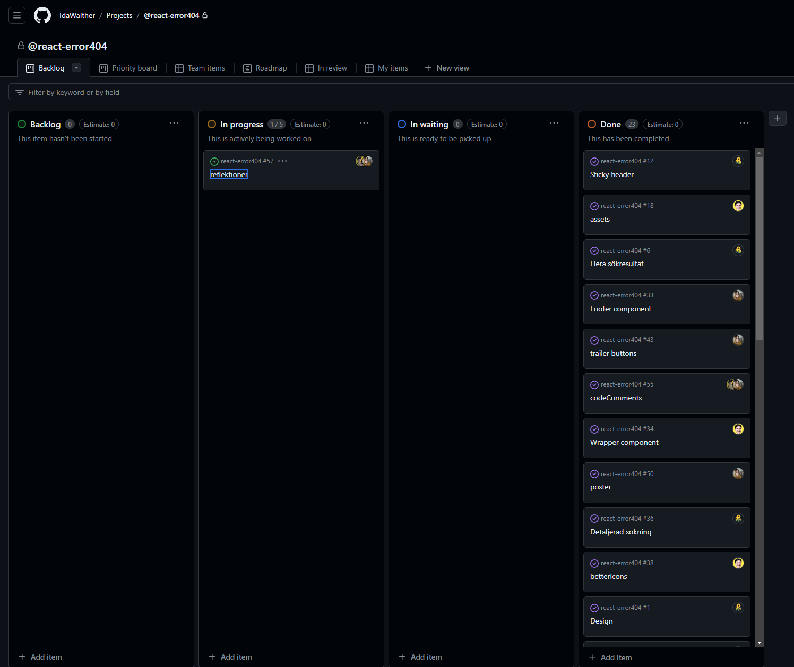

# Kanban-tavla:

# Gruppreflektioner

Svara på var och en av frågorna nedan som grupp, minst 100 tecken per fråga.

## Frågor

### Inledning-

#### Sammanfatta projektets syfte, samt era gemensamma mål
Syftet med projektet var att lära oss att arbeta med ett ramverk i detta fall react. Vårt gemensamma mål var att klara uppgiften samt att alla i gruppen skulle ha god förståelse för vår kod. 

#### Hur upplevde teamet projektet initialt?
Initialt upplevde vi projektet som en stor uppgift med högre krav än tidigare men när vi väl satte igång och arbetade kändes uppgiften mer överkomlig.

### Planering och genomförande

#### Beskriv hur ni inom teamet planerade projektet initialt
Vi startade med att lägga upp en kanban-board där vi la upp alla userStories med acceptanskriterier. Setup och Assets lades upp direkt tillsammans i gruppen samt att vi tog övergripande beslut tidigt så som att vi skulle använda Jespers design för att ha mer tid åt att förstå koden.

#### Vilka steg har teamet tagit för att utveckla applikationen?
Vi började med grundläggande setup för att därefter gå vidare med pages och komponenter. Dagliga möten och dialog har legat till grund för utvecklingen. 

### Teamets utmaningar och lösningar

#### Vika var de största utmaningarna för teamet?
De största utmaningarna för teamet var att ta beslut i början av processen, att t.ex. ta beslut kring design. Var också svårt att uppskatta hur mycket tid som skulle krävas till uppgiften.

#### Hur löste eller hanterade teamet dessa utmaningar?
Vi hanterade dessa utmaningar genom dialog i gruppen och beslutade att ta Jespers design för att spara oss tid. 

#### Vilka kompromisser inom teamet har ni gjort under projektets gång?
Vi har varit lyhörda för varandras önskemål och idéer men upplever att vi inte har behövt kompromissa i särskilt stor utsträckning. Då vi tog beslut kring vår design tidigt i processen så känner vi att vi har undvikit konflikter och kompromisser i stor utsträckning. 

### Teamets reflektion och utvärdering

#### Vad lärde sig gruppen inom projektet?
Vi har lärt oss att arbeta i ett frontendramverk (vite - React) tillsammans i grupp. Vi har även fått en förståelse kring hur man arbetar med zustand, router och andra hooks. Vi har också fått uppleva hur mycket enklare det är att sammarbeta kring kod när koden är uppdelad i komponenter vilket leder till färre git-konflikter.

#### Hur kan gruppen förbättra sitt samarbete framöver?
Att dela upp våra userStories i mindre issues hade underlättat arbetet. Att en person tar huvudansvar kring design. Vi hade inga egentliga konflikter runt designen men känner att om det skulle kunna skava någonstans så skulle det vara där.

### Arbeta Agilt

#### Beskriv mer utförligt (minst 300 tecken) på vilket sätt gruppen har arbetat agilt (vilka artefakter, aktiviteter osv har ni använt er av?)
Vi arbetade agilt genom att använda oss av en kanban-board i git. Under vår sprint planning lade vi in User-Stories i backloggen och skapade acceptanskriterier. Vi tog våra egna user-stories och konverterade dem till issues som sedan flyttades till in-progress. Då vi enbart hade en sprint skippades sprint-backlog. Dagen startades med en daily-scrum men vi valde att efter mötet sitta tillsammans så att vi kunde hjälpa varandra vid behov. Dessa gruppreflektioner ser vi som en sprint-retrospective då vi gått igenom vad som gått bra, vilka problem vi stött på och vad som kunde förbättrats. 